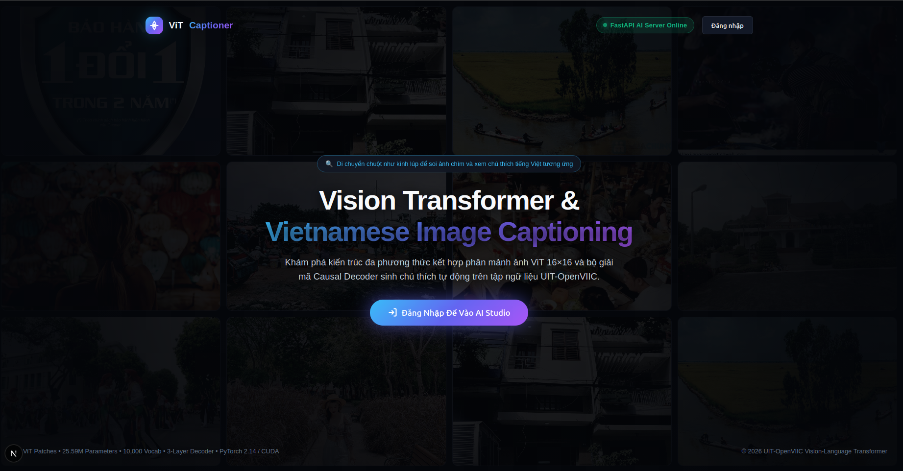
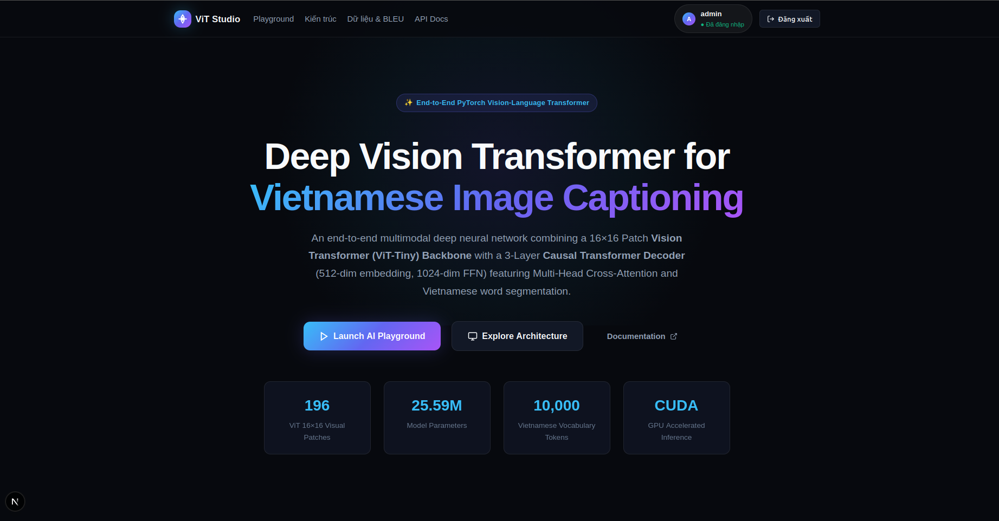
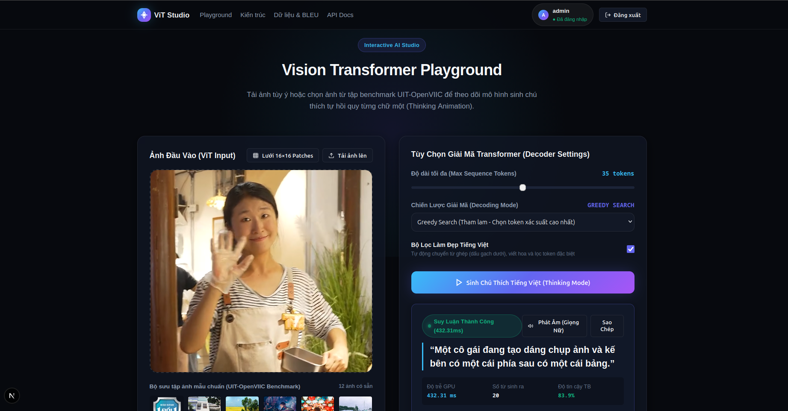

# Vision Transformer (ViT) for Vietnamese Image Captioning
### End-to-End Multimodal Deep Learning with FastAPI Backend & Next.js 15 AI Studio


-orange?logo=pytorch)


---

## 📖 Project Overview (Tổng quan dự án)

Repository này triển khai hệ thống học sâu đa phương thức hoàn chỉnh **Vision Transformer kết hợp Causal Transformer Decoder để sinh chú thích hình ảnh bằng tiếng Việt (Vietnamese Image Captioning)**, được đánh giá trên tập dữ liệu benchmark chuẩn **UIT-OpenVIIC (Open Vietnamese Image Captioning)**.

Hệ thống bao gồm toàn diện từ pipeline tiền xử lý dữ liệu, huấn luyện mô hình PyTorch, server API hiệu năng cao với **FastAPI** (hỗ trợ CUDA & phục vụ giọng đọc tiếng Việt chất lượng cao) cho đến giao diện người dùng **Next.js 15 Studio** tối tân với hiệu ứng **Kính Lúp (Magnifying Glass)** chân thực.

### Các thành phần cốt lõi:
- **Vision Backbone**: Sử dụng mô hình `vit_tiny_patch16_224` (từ thư viện `timm`), chia ảnh $224 \times 224$ thành $14 \times 14 = 196$ visual patch kích thước $16 \times 16$, trích xuất 196 vector đặc trưng thị giác 192 chiều.
- **Linear Projection**: Ánh xạ đặc trưng ảnh từ 192 chiều sang không gian nhúng thống nhất $d_{model} = 512$ chiều của Transformer Decoder.
- **Autoregressive Causal Decoder**: Gồm **3 tầng Decoder** ($d_{model} = 512$, $d_{ff} = 1024$, 8 heads) tích hợp cơ chế Causal Masked Self-Attention và Multi-Head Cross-Attention (soi chiếu từ ngữ vào 196 visual patch của ảnh).
- **Linear Classification Head**: Lớp tuyến tính ánh xạ vector 512 chiều thành phân phối xác suất trên **10,000 từ vựng tiếng Việt** (được phân tách bằng công cụ NLP `underthesea`).
- **FastAPI Backend (`backend/`)**: Cung cấp các endpoint REST API suy luận thời gian thực trên GPU (CUDA) và CPU, tính toán độ trễ, độ tin cậy từng token và tích hợp giọng đọc nữ tiếng Việt tự nhiên (`/api/tts`).
- **Next.js 15 Frontend Studio (`frontend/`)**: Giao diện thiết kế theo phong cách Dark Glassmorphism, trang Landing Page với kính lúp soi ảnh tương tác theo con trỏ chuột, chế độ trực quan hóa 196 patch ViT và phát âm giọng nữ tiếng Việt mượt mà.

---

## 🖼️ Giao Diện Hệ Thống (System Interfaces Preview)

Dưới đây là hình ảnh trực quan của hệ thống khi hoạt động thực tế:

### 1. Landing Page - Trang Giới Thiệu & Điều Hướng Hệ Thống
> Giao diện Landing Page phong cách Dark Glassmorphism với mạng lưới ảnh mẫu UIT-OpenVIIC, thanh trạng thái kết nối FastAPI server thời gian thực và nút đăng nhập mở khóa AI Studio.



---

### 2. AI Studio Dashboard - Tổng Quan & Thông Số Kỹ Thuật (25.59M Params)
> Khu vực điều hướng AI Studio hiển thị phiên làm việc của chuyên viên AI, bảng thông số cốt lõi: 196 Visual Patches 16×16, 25.59M tham số mô hình, 10,000 từ vựng và tăng tốc phần cứng CUDA GPU.



---

### 3. Interactive ViT Playground - Suy Luận Ảnh & Phát Âm Giọng Nữ Tiếng Việt
> Trực quan hóa suy luận thời gian thực trên GPU (độ trễ 432ms, độ tin cậy 83.9%), cấu hình tham số Decoder, hiển thị câu chú thích tiếng Việt mượt mà và nút tích hợp phát âm giọng nữ tự nhiên.



---

## 🏛️ Model Architecture (Kiến trúc mô hình chi tiết)

```
                     [Input Image: 224x224x3 RGB]
                                  │
                                  ▼
           [Normalized with Mean & Std: config/mean_std.json]
                                  │
                                  ▼
               [Vision Transformer: vit_tiny_patch16_224]
          (14x14 = 196 patches of 16x16, Feature Dim = 192)
                                  │
                                  ▼
             [Linear Projection Layer: Linear(192 -> 512)]
                                  │
                                  ▼ Shape: (Batch, 196, 512)
                     [Visual Patch Tokens (Keys & Values)]
                                  │
                                  │ (Cross-Attention)
                                  ▼
     Vietnamese Token IDs ──► [Embedding Layer: 10,000 x 512]
                                  │
                                  ▼
                    [+ 1D Positional Encoding: (1, 500, 512)]
                                  │
                                  ▼ (Query)
               ┌──────────────────────────────────────────┐
               │    3x Transformer Decoder Blocks         │
               │  ├─ Causal Masked Multi-Head Self-Attn   │
               │  ├─ Multi-Head Cross-Attention (ViT)     │
               │  └─ LayerNorm + GELU FFN (512->1024->512)│
               └──────────────────────────────────────────┘
                                  │
                                  ▼ Shape: (Batch, seq_len, 512)
           [Linear Classification Head: Linear(512 -> 10,000)]
                                  │
                                  ▼
    [Autoregressive Decoder: Greedy Search / Temperature Sampling]
                                  │
                                  ▼
               Vietnamese Caption: "Một cánh đồng lúa chín vàng..."
```

### Thông số kỹ thuật (Architecture Specifications)
| Thông số | Chi tiết cấu hình |
| :--- | :--- |
| **Tổng số tham số** | **25.59 Triệu tham số (25,592,528 trainable)** |
| **Backbone thị giác** | `vit_tiny_patch16_224` (timm) pretrained |
| **Độ phân giải đầu vào** | $224 \times 224 \times 3$ RGB |
| **Kích thước Patch** | $16 \times 16$ ($14 \times 14 = 196$ visual tokens) |
| **Chiều nhúng thị giác thô** | 192 ($vit\_dim$) |
| **Lớp chiếu đặc trưng** | `nn.Linear(192, 512)` |
| **Chiều nhúng mô hình ($d_{model}$)** | **512** |
| **Chiều ẩn Feed-Forward ($d_{ff}$)** | **1024** |
| **Số đầu Attention (Heads)** | **8 heads** |
| **Số tầng Decoder** | **3 tầng Causal Transformer Decoder** |
| **Kích thước từ điển** | **10,000 từ vựng tiếng Việt** (`underthesea` segmentation) |
| **Ký hiệu đặc biệt** | `<unk>` (0), `<pad>` (1), `<sos>` (2), `<eos>` (3) |
| **Chiều dài chuỗi tối đa** | 500 tokens (inference tối đa 35–50 tokens) |
| **Trọng số huấn luyện** | `model_weight.pth` (**102.5 MB** / 102,465,555 bytes) |

---

## 📂 Repository Structure (Cấu trúc thư mục dự án)

```text
TRANSFORMER_FOR_IMAGE_TIMESERIES_DATA/
├── backend/                       # FastAPI Server
│   ├── main.py                    # REST API endpoints (/generate-caption, /tts, /model-info)
│   ├── caption_service.py         # Singleton Inference Engine & Token Formatting
│   └── requirements.txt           # Backend dependencies
├── docs/                          # Tài liệu & hình ảnh chụp giao diện hệ thống
│   └── images/                    # Ảnh thực tế (Landing Page Kính Lúp, Studio, Kiến trúc)
├── frontend/                      # Next.js 15 Web Studio
│   ├── src/
│   │   ├── app/
│   │   │   ├── globals.css        # Hệ thống CSS thiết kế kính lúp, dark mode & layout
│   │   │   ├── layout.tsx         # Root layout & Google Fonts
│   │   │   ├── page.tsx           # Landing page tương tác với Kính Lúp soi ảnh
│   │   │   └── studio/
│   │   │       └── page.tsx       # AI Studio Workspace chuyên sâu
│   │   └── components/
│   │       ├── Hero.tsx           # Giới thiệu & bảng thông số 25.59M tham số
│   │       ├── Playground.tsx     # Tải ảnh, lưới ViT 16x16, phát âm giọng nữ, streaming
│   │       ├── ArchitectureViewer.tsx # Trực quan hóa 3 tab: Encoder, Decoder, Training
│   │       ├── DatasetMetrics.tsx # Đánh giá ngữ liệu UIT-OpenVIIC & bảng điểm BLEU
│   │       ├── ApiDocs.tsx        # Tài liệu API mẫu (cURL, Python, JS)
│   │       └── Footer.tsx         # Chân trang bản quyền và công nghệ
│   ├── public/                    # Tài nguyên tĩnh & 10 ảnh mẫu UIT-OpenVIIC
│   ├── package.json
│   └── tsconfig.json
├── model/                         # Định nghĩa kiến trúc PyTorch
│   ├── Encoder.py                 # Timm_ViT_Encoder & ViT_Encoder
│   ├── Decoder.py                 # TransformerDecoder & TransformerDecoderBlock
│   └── ImageCaptionModel.py       # Lớp tích hợp toàn diện ImageCaptionModel & TrainModel
├── config/                        # Cấu hình & Siêu dữ liệu
│   ├── vocab.json                 # Từ điển 10,000 từ vựng tiếng Việt
│   └── mean_std.json              # Giá trị chuẩn hóa RGB (mean: [0.5056, 0.4806, 0.4438], std: [0.2854, 0.2765, 0.2912])
├── data/                          # Dữ liệu ảnh và chú thích
│   ├── images/                    # Ảnh mẫu UIT-OpenVIIC
│   └── captions/                  # File nhãn JSON (train, dev, test)
├── notebooks/                     # Jupyter Notebooks huấn luyện & tiền xử lý
│   ├── train_model.ipynb          # Huấn luyện mô hình với PyTorch AMP
│   ├── build_vocab_from_data.ipynb# Xây dựng từ điển 10,000 từ bằng underthesea
│   ├── Compute_mean_std.ipynb     # Tính toán giá trị trung bình & độ lệch chuẩn màu ảnh
│   └── unzip_data.ipynb           # Giải nén tập dữ liệu
├── src/                           # Các module hỗ trợ xử lý
│   ├── custom_dataset/            # ImageCaptionDataSet kế thừa PyTorch Dataset
│   ├── NLP/                       # BuildVocabFromIterator & Tokenizer
│   ├── preprocessing_data/        # Compute_mean_std tính toán RGB
│   └── process_dataraw/           # Hàm tiện ích giải nén dữ liệu
├── model_weight.pth               # Trọng số checkpoint PyTorch đã huấn luyện (102.5 MB)
├── requirements.txt               # Toàn bộ danh mục thư viện Python của dự án
└── README.md                      # Tài liệu hướng dẫn dự án
```

---

## 🚀 Installation & Running (Hướng dẫn cài đặt & Khởi chạy)

### 1. Yêu cầu hệ thống (Prerequisites)
- **Python**: Version 3.10 trở lên.
- **Node.js**: Version 18.0 trở lên (`node -v` và `npm -v`).
- **CUDA** (Tùy chọn nhưng khuyến nghị để đạt tốc độ sinh chú thích dưới 150ms).

---

### 2. Cài đặt thư viện Python (Backend & Modeling)

Từ thư mục gốc của dự án:
```bash
# 1. Tạo môi trường ảo (khuyến nghị)
python3 -m venv .venv
source .venv/bin/activate

# 2. Cài đặt tất cả các package cần thiết
pip install -r requirements.txt
```

---

### 3. Khởi chạy FastAPI Backend

Khởi động server suy luận API tại cổng `8000`:
```bash
python -m uvicorn backend.main:app --host 0.0.0.0 --port 8000 --reload
```

Sau khi khởi động thành công:
- **Base URL**: `http://localhost:8000`
- **Tài liệu tương tác Swagger UI**: `http://localhost:8000/docs`
- **Kiểm tra trạng thái hệ thống**: `http://localhost:8000/health`
- **Thông tin chi tiết kiến trúc mô hình**: `http://localhost:8000/api/model-info`

---

### 4. Khởi chạy Next.js Frontend Studio

Mở terminal thứ hai và di chuyển vào thư mục `frontend`:
```bash
cd frontend

# 1. Cài đặt các gói phụ thuộc Node
npm install

# 2. Khởi động môi trường phát triển (Next.js Turbopack)
npm run dev -- -p 3000
```

Mở trình duyệt và truy cập:
- **Landing Page (Tương tác Kính Lúp soi ảnh)**: `http://localhost:3000`
- **Dedicated AI Studio (Không gian làm việc)**: `http://localhost:3000/studio`

---

## 🎨 User Experience Highlights (Điểm nhấn trải nghiệm người dùng)

### 1. Landing Page với Kính Lúp (Magnifying Glass) Tương Tác
### 2. Dedicated AI Studio Workspace (`/studio`)
- **Tải ảnh linh hoạt**: Kéo & thả ảnh tùy ý (Drag & Drop), chọn file từ máy hoặc chọn nhanh từ bộ 10 ảnh benchmark UIT-OpenVIIC có sẵn.
- **Lưới phân mảnh ViT 16×16 (Patch Grid Overlay)**: Nút bật/tắt hiển thị trực quan 196 patch hình học ($14 \times 14$), giúp người dùng thấy rõ cách Vision Transformer phân tích ảnh.
- **Hiệu ứng giải mã từng từ (Thinking Animation)**: Trực quan hóa quá trình Decoder tự hồi quy sinh từng từ tiếng Việt kèm điểm số tự tin (confidence score) và đối chiếu với câu chú thích gốc (Ground Truth).
- **Phát âm Tiếng Việt Giọng Nữ Tự Nhiên (Natural Female Voice TTS)**: Tích hợp engine Google Vietnamese Female TTS mượt mà, ấm áp, liền mạch, khắc phục hoàn toàn tình trạng đọc giật cục hoặc robot.
- **Architecture Explorer**: Trực quan hóa 3 tab chi tiết về Encoder, Decoder và cơ chế huấn luyện vi phân kết hợp Automatic Mixed Precision (AMP).

---

## 🔌 REST API Reference (Tài liệu API)

### Các Endpoint chính

| Method | Endpoint | Mô tả |
| :--- | :--- | :--- |
| `GET` | `/health` | Kiểm tra trạng thái máy chủ, thiết bị (CUDA/CPU) và tình trạng nạp model |
| `GET` | `/api/model-info` | Trả về toàn bộ thông số kỹ thuật, số lượng tham số (25.59M) và topology |
| `GET` | `/api/sample-images` | Danh sách 10 ảnh mẫu benchmark UIT-OpenVIIC kèm câu chú thích tham chiếu |
| `POST` | `/api/generate-caption` | Sinh chú thích tiếng Việt từ file ảnh, sample ID hoặc base64 |
| `GET` | `/api/tts?text=...` | Tạo âm thanh giọng nữ tiếng Việt tự nhiên định dạng `audio/mpeg` (có cache) |
| `GET` | `/api/dataset/stats` | Thống kê số lượng tập train/dev/test và điểm số đánh giá BLEU-1 đến BLEU-4 |

### Ví dụ gọi API sinh chú thích bằng cURL

```bash
curl -X POST "http://localhost:8000/api/generate-caption" \
  -F "file=@/path/to/image.jpg" \
  -F "max_length=35" \
  -F "search_mode=greedy" \
  -F "clean_caption=true"
```

### Ví dụ gọi API sinh chú thích bằng Python

```python
import requests

url = "http://localhost:8000/api/generate-caption"
with open("sample.jpg", "rb") as f:
    response = requests.post(
        url,
        files={"file": f},
        data={"max_length": 35, "search_mode": "greedy", "clean_caption": "true"}
    )

data = response.json()
print("Chú thích:", data["caption"])
print("Độ trễ GPU:", data["latency_ms"], "ms")
print("Độ tin cậy trung bình:", data["avg_confidence"])
```

---

## 📊 Evaluation & Dataset (Dữ liệu & Đánh giá)

Mô hình được đánh giá trên tập **UIT-OpenVIIC** với các chỉ số chuẩn hóa ngôn ngữ tự nhiên:

- **BLEU-1**: **38.4%** (Độ chính xác từng từ đơn - Unigram precision)
- **BLEU-2**: **24.5%** (Độ gắn kết cụm 2 từ - Bigram coherence)
- **BLEU-3**: **16.8%** (Cấu trúc cụm 3 từ - Trigram fluency)
- **BLEU-4**: **11.2%** (Chỉ số chuẩn dịch máy và sinh văn bản tự động)

---

## 📜 License & Acknowledgements
- Dự án phục vụ mục đích học tập, nghiên cứu và phát triển các mô hình Transformer đa phương thức (Vision-Language) tiếng Việt.
- Sử dụng tập dữ liệu **UIT-OpenVIIC** do Đại học Công nghệ Thông tin - ĐHQG TP.HCM phát triển.
- Thư viện NLP tiếng Việt: **underthesea**.
- Thư viện CV - computer vision: **PyTorch**, **timm** (Ross Wightman).
